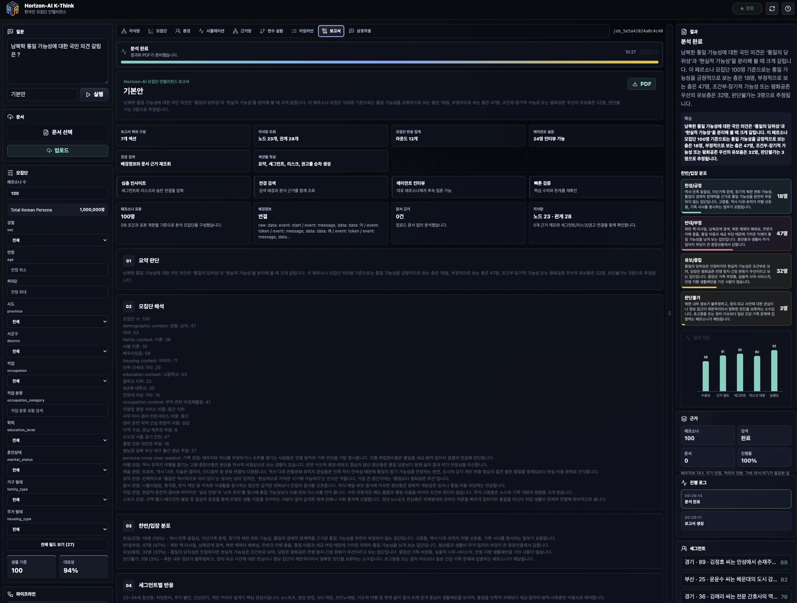
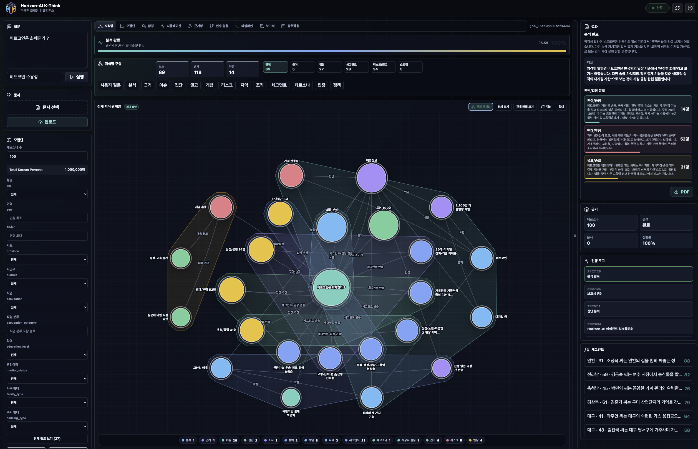
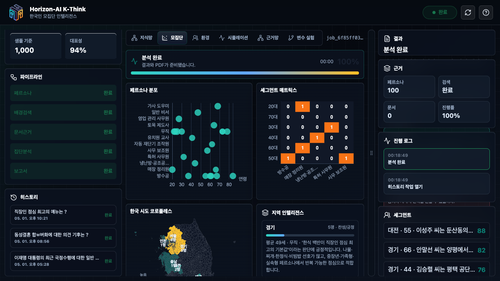
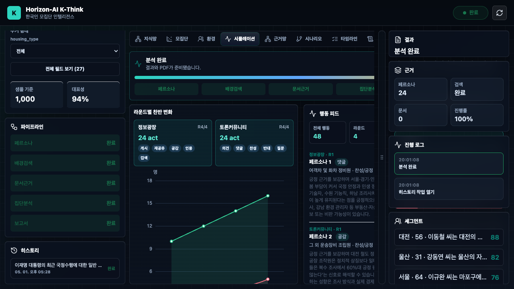
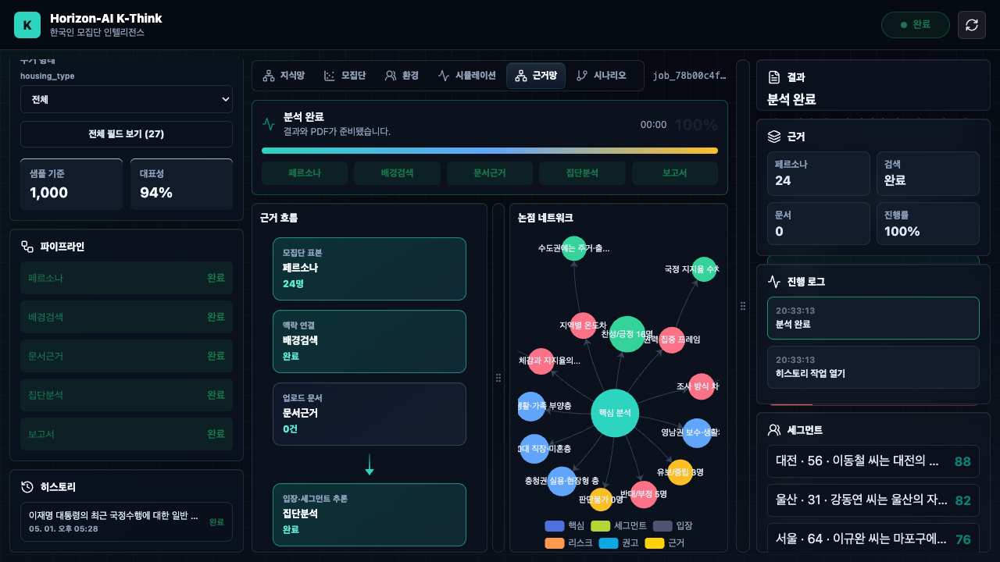
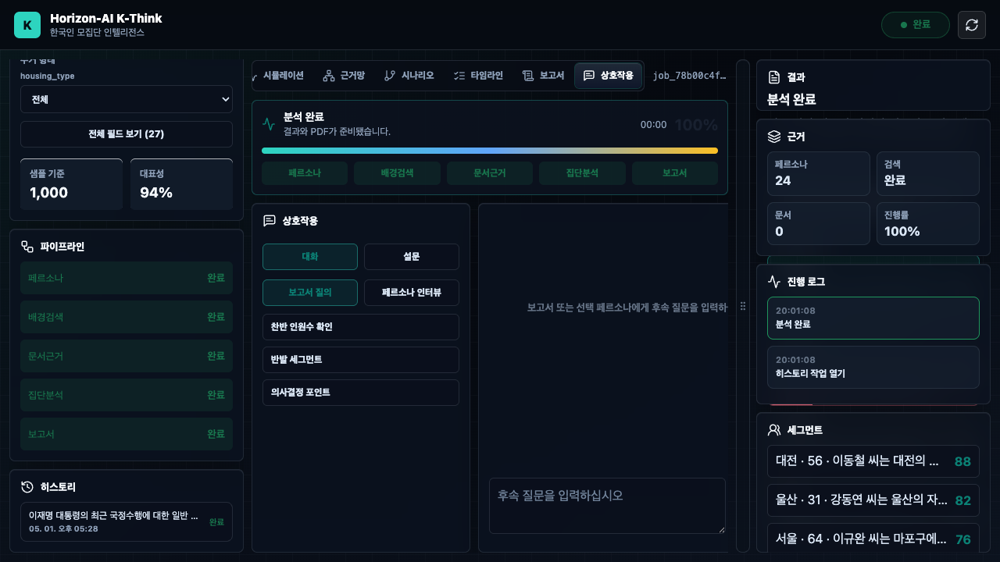

# Horizon-AI K-Think

> 데모 사이트: [https://research.horizonai.ai](https://research.horizonai.ai)

Horizon-AI K-Think는 약 700만 개 한국인 페르소나 기반의 AI 집단 인텔리전스 시스템입니다. 질문, 정책, 메시지, 사회 이슈에 대해 가상 모집단을 구성하고, 세그먼트별 반응과 찬반 분포, 근거 관계, What-if 변화, 실행 권고를 하나의 분석 리포트로 시각화합니다.

이 프로젝트는 단순 설문형 챗봇이 아니라, 한국인 페르소나 모집단을 대상으로 표본 구성, 배경 맥락 결합, 문서 근거 반영, 여론 변화 시뮬레이션, 지식 그래프, 보고서 자동화를 연결한 의사결정 분석 제품입니다.

모집단 분석의 기반은 공개 한국인 페르소나 데이터셋 [nvidia/Nemotron-Personas-Korea](https://huggingface.co/datasets/nvidia/Nemotron-Personas-Korea)입니다.

## 핵심 가치

- 한국인 페르소나 기반 의사결정 실험: 성별, 연령, 지역, 직업, 학력, 혼인상태, 가구 형태, 주거 형태 등 다양한 조건으로 모집단을 구성합니다.
- 질문 맞춤형 집단 반응 분석: 사용자의 질문에 맞춰 찬성, 반대, 중립, 판단불가 분포와 그 이유를 구조화합니다.
- 세그먼트별 인사이트: 집단을 하나의 평균값으로 보지 않고, 지역/직업/연령/생활 맥락별 차이를 분석합니다.
- 근거 중심 보고서: 배경 맥락, 업로드 문서, 페르소나 반응, 시뮬레이션 결과를 최종 보고서와 연결합니다.
- What-if 실험: 메시지 명확성, 근거 강도, 개인 관련성, 실행 마찰 같은 변수를 조정해 예상 변화를 비교합니다.
- 시각 분석 UI: 지식망, 근거망, 모집단 분포, 한국 지도, 시뮬레이션 타임라인, 보고서를 한 화면에서 탐색합니다.

## 기술적 성과

### 1. 한국인 페르소나 모집단 샘플링

K-Think는 한국인 페르소나 데이터를 단순 목록으로 다루지 않고, 분석 목적에 맞는 표본 모집단으로 재구성합니다. 성별, 연령, 지역, 직업, 학력, 혼인상태, 가족 형태, 주거 형태 등 여러 필터를 결합해 분석 대상을 좁히고, 선택된 표본의 대표성을 별도로 계산합니다.

대표성 평가는 분포 유사도, 표본 충분성, 모집단 커버리지를 함께 반영합니다. 따라서 사용자는 "몇 명을 뽑았는가"뿐 아니라 "이 표본이 질문에 답할 만큼 균형 잡혀 있는가"를 함께 확인할 수 있습니다.

### 2. 7관점 페르소나 해석

각 페르소나는 직업, 스포츠, 예술, 여행, 음식, 가족, 요약 관점의 텍스트 맥락을 포함합니다. K-Think는 이 다중 관점을 분석 프롬프트에 결합해 한 사람의 단편적 속성보다 더 입체적인 반응을 추정합니다.

이 방식은 정책 수용성, 소비자 메시지, 지역 이슈, 사회적 갈등처럼 개인의 생활 맥락이 중요한 질문에서 세그먼트별 차이를 더 풍부하게 드러냅니다.

### 3. 지식 그래프 자동 구성

분석 과정에서 사용자 질문, 입장, 세그먼트, 근거, 리스크, 권고, 문서, 시뮬레이션 결과를 노드와 엣지로 변환합니다. 추출된 그래프는 중복 노드를 병합하고 관계 유형을 정규화해, 보고서의 결론이 어떤 근거에서 도출됐는지 시각적으로 추적할 수 있게 합니다.

지식망은 단순 장식용 차트가 아니라 분석 흐름의 감사 추적 장치입니다. 질문에서 배경 근거, 페르소나 반응, 세그먼트 인사이트, 최종 권고로 이어지는 연결 구조를 확인할 수 있습니다.

### 4. 문서 근거 결합

사용자가 업로드한 문서를 분석 입력으로 결합해, 질문과 직접 관련된 내부 자료나 리서치 문서를 반영할 수 있습니다. 문서에서 추출된 핵심 내용은 근거망과 보고서에 연결되어, 최종 판단이 어떤 자료를 기반으로 하는지 확인할 수 있습니다.

이를 통해 K-Think는 일반적인 여론 추정뿐 아니라 기업 리서치, 정책 검토, 보고서 초안, 캠페인 메시지 검증처럼 자료 기반 분석이 필요한 업무에도 사용할 수 있습니다.

### 5. 페르소나 여론 시뮬레이션

K-Think는 분석 결과를 정적인 찬반표로 끝내지 않고, 라운드 기반의 여론 변화 시뮬레이션으로 확장합니다. 정보 확산, 토론, 반론, 수렴 단계를 거치며 찬성/반대/중립 흐름과 세그먼트 반응을 시간축으로 보여줍니다.

시뮬레이션은 전체 모집단 모드와 표본 모드를 지원하고, 빠른 계산 방식과 개별 페르소나 인터뷰 방식의 두 가지 해석 경로를 제공합니다. 사용자는 속도와 정밀도의 균형을 선택할 수 있습니다.

### 6. What-if 민감도 분석

질문마다 중요한 변화 요인을 자동으로 구성하고, 사용자가 조정할 수 있는 레버로 제공합니다. 메시지 강도, 근거 보강, 비용 부담, 신뢰도, 지역성 같은 조건이 바뀌었을 때 수용성이나 리스크가 어떻게 달라질지 비교합니다.

이 기능은 정책 문구 개선, 광고 메시지 테스트, 제품 포지셔닝, 공공 커뮤니케이션 전략 수립에 바로 활용할 수 있습니다.

### 7. 보고서 자동화

분석 결과는 요약 판단, 모집단 해석, 입장 분포, 세그먼트 인사이트, 시나리오 변화, What-if 분석, 근거와 한계, 실행 권고로 재구성됩니다. 차트와 그래프를 포함한 보고서 형태로 정리되어 회의, 리서치 공유, 의사결정 문서화에 사용할 수 있습니다.

## 주요 기능

- 모집단 필터링: 성별, 연령, 시도, 시군구, 직업, 학력, 혼인상태, 가구 형태, 주거 형태 기반 타깃 구성
- 대표성 점수: 표본 분포 유사도, 표본 충분성, 모집단 커버리지 기반 점수화
- 집단 반응 분석: 찬성, 반대, 중립, 판단불가 분포와 근거 요약
- 세그먼트 매트릭스: 직업, 연령, 지역 등 주요 세그먼트별 반응 차이 탐색
- 한국 지도 대시보드: 지역 기반 모집단 분포와 반응 흐름 시각화
- 지식망/근거망: 질문, 근거, 세그먼트, 리스크, 권고 관계 시각화
- 시뮬레이션: 라운드별 여론 변화, 행동 피드, 불확실성/편향 신호 제공
- What-if 분석: 질문 맥락에 맞춘 변수 조정과 민감도 비교
- 보고서: 한국어 분석 보고서와 시각 자료 기반 결과 공유

## 활용 분야

- 공공 정책 수용성 분석
- 지역/세대/직업군별 여론 반응 탐색
- 광고 메시지와 캠페인 카피 사전 검증
- 신제품 컨셉과 가격/혜택 조건 테스트
- 사회 이슈와 리스크 커뮤니케이션 전략 수립
- 리서치 보고서 초안 생성과 근거 구조화

## 화면 예시

### 분석 보고서

### 지식망

### 모집단 코로플레스

### 시뮬레이션

### 근거망

### 상호작용

## Product Stack

K-Think는 분석 경험을 만들기 위해 Vue 기반 인터페이스, D3/Cytoscape 기반 네트워크 시각화, ECharts 기반 대시보드 차트, 한국어 보고서 생성 로직, 페르소나 시뮬레이션 엔진을 결합해 구현되었습니다.
